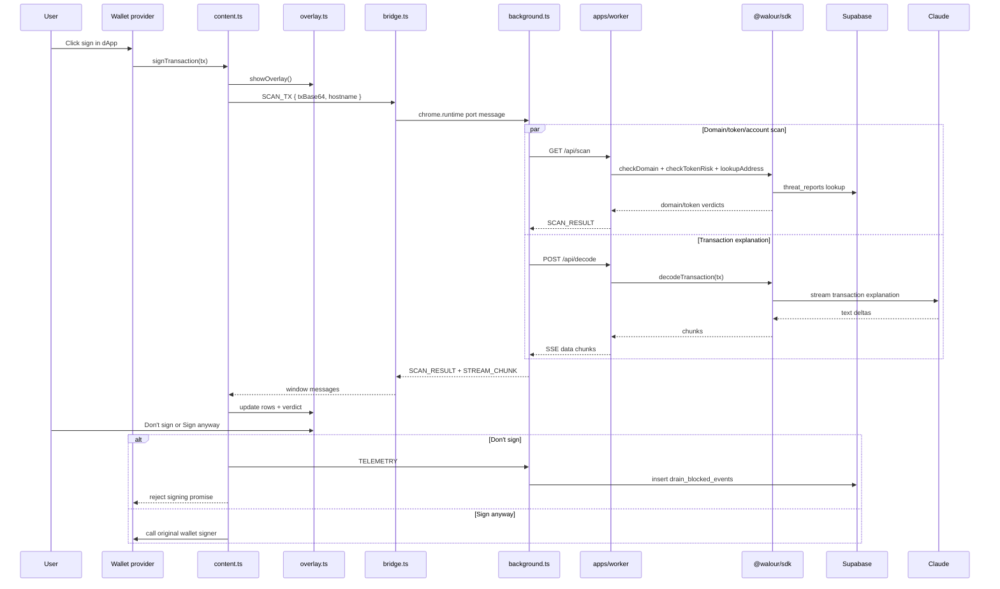

# Walour Current Architecture Diagram

This diagram reflects the implementation currently present in `D:\Walour\walour`.

```mermaid
flowchart TB
  user["User on dApp page"] --> wallet["Injected Solana wallet provider<br/>Phantom / Solflare / Backpack"]

  subgraph ext["apps/extension - Chrome MV3"]
    content["content.ts<br/>MAIN world wallet hook<br/>wraps signTransaction + signAndSendTransaction"]
    overlay["overlay.ts<br/>Shadow DOM security modal"]
    bridge["bridge.ts<br/>isolated world bridge"]
    bg["background.ts<br/>service worker"]
    popup["popup.ts<br/>latest tab scan summary"]
  end

  wallet --> content
  content --> overlay
  content -- "window.postMessage<br/>SCAN_TX { txBase64, hostname }" --> bridge
  bridge -- "chrome.runtime.connect<br/>walour-scan port" --> bg
  bg --> popup

  subgraph worker["apps/worker - Web API / Vercel handlers"]
    scan["/api/scan<br/>scan.ts"]
    decode["/api/decode<br/>decode.ts<br/>SSE stream"]
    blink["/api/blink<br/>Dialect Action response"]
    ingest["/api/ingest<br/>threat source ingestion"]
    purge["/api/purge<br/>old low-confidence cleanup"]
    promote["promote.ts<br/>high-confidence on-chain promotion"]
  end

  bg -- "GET /api/scan?hostname&tx" --> scan
  bg -- "POST /api/decode { txBase64 }" --> decode
  bg -- "POST drain_blocked_events" --> supabase
  decode -- "SSE chunks" --> bg
  bg -- "SCAN_RESULT / STREAM_CHUNK" --> bridge
  bridge -- "window.postMessage updates" --> content
  content --> overlay

  subgraph sdk["packages/sdk - @walour/sdk"]
    sdkIndex["index.ts exports"]
    checkDomain["checkDomain(hostname)<br/>domain-check.ts"]
    lookupAddress["lookupAddress(pubkey)<br/>domain-check.ts"]
    tokenRisk["checkTokenRisk(mint)<br/>token-risk.ts"]
    txDecoder["decodeTransaction(tx)<br/>tx-decoder.ts"]
    cache["lib/cache.ts<br/>Upstash Redis wrapper"]
    breaker["lib/circuit-breaker.ts<br/>3 failures / 30s cooldown"]
    rpcFallback["lib/rpc.ts<br/>Helius -> Triton -> RPC Fast -> public RPC"]
    privateReport["submitPrivateReportCloak()<br/>optional Cloak SDK"]
  end

  scan --> checkDomain
  scan --> tokenRisk
  scan --> lookupAddress
  decode --> txDecoder
  blink --> lookupAddress
  blink --> tokenRisk
  sdkIndex --> checkDomain
  sdkIndex --> lookupAddress
  sdkIndex --> tokenRisk
  sdkIndex --> txDecoder
  sdkIndex --> rpcFallback
  sdkIndex --> privateReport

  checkDomain --> cache
  lookupAddress --> cache
  tokenRisk --> cache
  txDecoder --> cache
  tokenRisk --> breaker
  txDecoder --> breaker
  rpcFallback --> breaker

  subgraph external["External services"]
    upstash["Upstash Redis<br/>token:risk, domain:risk,<br/>address:threat, tx:decode"]
    supabase["Supabase Postgres + REST<br/>threat_reports<br/>drain_blocked_events<br/>ingestion_errors<br/>outages"]
    helius["Helius RPC"]
    triton["Triton RPC"]
    rpcfast["RPC Fast"]
    publicRpc["Solana public RPC"]
    goplus["GoPlus Security API"]
    anthropic["Anthropic Claude Haiku 4.5<br/>streaming tx decoder"]
    chainabuse["Chainabuse"]
    scamsniffer["ScamSniffer blacklist"]
    twitter["Twitter/X recent search"]
  end

  cache --> upstash
  checkDomain --> supabase
  checkDomain --> goplus
  lookupAddress --> supabase
  lookupAddress --> helius
  tokenRisk --> helius
  tokenRisk --> goplus
  txDecoder --> helius
  txDecoder --> anthropic
  rpcFallback --> helius
  rpcFallback --> triton
  rpcFallback --> rpcfast
  rpcFallback --> publicRpc

  ingest --> chainabuse
  ingest --> scamsniffer
  ingest --> goplus
  ingest --> twitter
  ingest -- "normalise + dedupe + upsert_threat RPC" --> supabase
  purge --> supabase

  subgraph web["apps/web - Next.js public app"]
    landing["/ landing page"]
    registry["/registry<br/>searchable threat table"]
    stats["/stats<br/>live counts + provider health"]
    apiThreats["/api/threats"]
    apiReport["/api/report<br/>community report"]
  end

  landing --> supabase
  registry --> apiThreats
  stats --> supabase
  apiThreats --> supabase
  apiReport -- "upsert_threat RPC<br/>source=community" --> supabase

  subgraph oracle["programs/walour_oracle - Anchor"]
    program["walour_oracle program<br/>A2pxWB5ro...ZVQ (devnet)"]
    configPda["OracleConfig PDA<br/>seed: config"]
    treasuryPda["Treasury PDA<br/>seed: treasury<br/>collects 0.01 SOL stake per submit"]
    threatPdaNs["ThreatReport PDA (community)<br/>seed: threat + address + first_reporter"]
    threatPdaAuth["ThreatReport PDA (authority)<br/>seed: threat + address"]
  end

  promote -- "authority_submit_report()" --> program
  promote -- "update_confidence()" --> program
  lookupAddress -- "on-chain PDA via WALOUR_PROGRAM_ID +<br/>WALOUR_ORACLE_CLUSTER (default devnet)" --> threatPdaAuth
  lookupAddress -- "fallback: getProgramAccounts memcmp scan" --> threatPdaNs
  program --> configPda
  program --> treasuryPda
  program --> threatPdaNs
  program --> threatPdaAuth
  program --> helius
```

## Hot Path: Wallet Signing

## SDK Export Map

| Export | Called by | Main dependencies | Cache key |
|---|---|---|---|
| `checkDomain(hostname)` | `/api/scan` | Supabase threat corpus, GoPlus phishing API | `domain:risk:{hostname}` |
| `lookupAddress(pubkey)` | `/api/scan`, `/api/blink`, `decodeTransaction` | Supabase, optional on-chain PDA via Helius | `address:threat:{pubkey}` |
| `checkTokenRisk(mint)` | `/api/scan`, `/api/blink` | Helius token RPC, GoPlus token security, Walour corpus | `token:risk:{mint}` |
| `decodeTransaction(tx)` | `/api/decode` | Helius ALT resolution, corpus account checks, Claude streaming | `tx:decode:{hash}` |
| `withRpcFallback(fn)` | direct SDK consumers | Helius, Triton, RPC Fast, public RPC | none |
| `submitPrivateReportCloak(...)` | direct SDK consumers | optional `@cloak.dev/sdk` | none |

## Data Stores

| Store | Role |
|---|---|
| Upstash Redis | SDK hot-path cache for token, domain, address, and transaction decode results. |
| Supabase `threat_reports` | Canonical off-chain threat corpus used by SDK, web app, worker, and community reporting. |
| Supabase `drain_blocked_events` | Extension telemetry for blocked signing events and stats dashboard counts. |
| Supabase `ingestion_errors` / `outages` | Operational logs for source ingestion and provider health. |
| Solana `walour_oracle` PDAs | On-chain shared threat registry: `OracleConfig`, `Treasury` (0.01 SOL anti-spam stake), namespaced `ThreatReport` (community, seed includes reporter), and authority-fast-track `ThreatReport` (legacy seed). |

